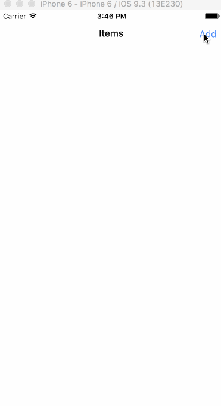

# Master Detail Application

_This is part of the Facebook Tel-Aviv React Native Hackathon._

<h3 align="center">
  
</h3>
<br/>
<br/>

This template is designed to do a master-detail layout for React Native, using nothing but
React Native itself. There's no Redux or any other ecosystem component to avoid breakage,
we also have decided not to adopt NavigatorExperimental just yet.
## Quick Start

Make a new React Native application:

```
$ react-native init MyNewApp
$ cd MyNewApp
```

Install and run the template:

```
$ npm install -g rn-master-detail-template
$ rn-master-detail-template
copying template...
installing dependencies...
done!
```

Done!


## Components

The structure is as simple as we could make it.

### App

App wraps navigation rendering and state using `Navigator`, a simple redux-like
store, and an event emitter for navigation.

### Store

The Store uses `EventEmitter` and consumers of that store will use `Subscribable` in order
to listen to changes. It is nothing but a simple state manipulator; and you could replace
that with Redux, ImmutableJS or anything else.

### Master

The Master displays a list of items, along with coordinating rendering of cells.

### Detail

The Detail will display a single item. It's also responsible to respond to navigator commands,
such as 'Save'.


